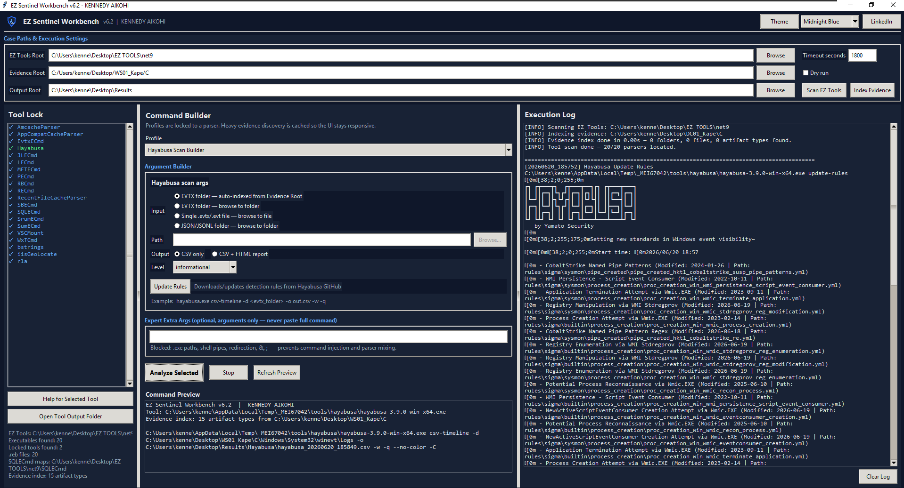

# EZ Sentinel Workbench v6.2

Author: **KENNEDY AIKOHI**  
LinkedIn: https://www.linkedin.com/in/aikohikennedy/

EZ Sentinel Workbench is a Windows GUI wrapper for Eric Zimmerman command-line tools and selected third-party forensic tools. It is designed for KAPE-style evidence folders and collected Windows artifacts.

v6.2 adds a Hayabusa wrapper integration for Sigma-style Windows event detection. EZ Sentinel Workbench does not own Hayabusa or the Hayabusa rules; it includes Hayabusa as a third-party parser so investigators can launch Hayabusa workflows from the same GUI. The wrapper auto-discovers `tools\hayabusa\hayabusa-3.9.0-win-x64.exe` and runs the included upstream Hayabusa `rules` and `config` folders against EVTX folders, single EVTX files, or JSON/JSONL Windows event logs.

## What changed in v6.2

- Added locked Hayabusa wrapper profiles for EVTX CSV output, EVTX CSV plus HTML report, single EVTX, and JSON/JSONL Windows event logs.
- Included Hayabusa v3.9.0 with upstream Hayabusa rules and config under `tools\hayabusa` for convenience and offline use.
- Added project-local tool discovery so bundled tools are found even when the EZ Tools Root points elsewhere.
- Added live-log backpressure so noisy parsers cannot flood the Tk event queue and freeze the GUI.
- Switched tool-list status markers to ASCII for cleaner Windows build output.

## Install

### Option 1: Use the Windows executable

1. Download `EZSentinelWorkbench.exe` from the GitHub release.
2. Place it in any folder where your user account can write output files.
3. Double-click `EZSentinelWorkbench.exe`.
4. In the app, set:
   - **EZ Tools Root** to your Eric Zimmerman tools folder.
   - **Evidence Root** to the collected evidence folder.
   - **Output Root** to the folder where reports should be written.

Hayabusa is included with the app under `tools\hayabusa`, so users do not need to install Hayabusa separately for the included Hayabusa workflows.

### Option 2: Run from source

```cmd
git clone https://github.com/kennedy-aikohi/EZ-Sentinel-Workbench.git
cd EZ-Sentinel-Workbench
python ez_sentinel_workbench.py
```

Requirements:

- Windows 10 or later.
- Python 3.10 or later if running from source or rebuilding the executable.
- Eric Zimmerman command-line tools for the non-Hayabusa parser profiles.

## Third-party attribution

EZ Sentinel Workbench is a wrapper/launcher. Third-party tools remain owned by their respective projects and authors.

- **Hayabusa** is created and maintained by Yamato Security: https://github.com/Yamato-Security/hayabusa
- **Hayabusa rules** are provided by the Hayabusa rules project and upstream rule authors: https://github.com/Yamato-Security/hayabusa-rules
- Included Hayabusa rules are licensed under the Detection Rule License (DRL) 1.1. See `tools\hayabusa\rules\LICENSE.md`.
- Rule output may include author fields from the rules. Those author attributions should be retained when sharing results or derived rule sets.

## What changed in v6

- Fixed UI freezing by moving EZ Tools scanning and evidence indexing into background threads.
- Stopped heavy recursive file discovery from running every time the command preview refreshes.
- Added a cached evidence index for paths like `$MFT`, `ActivitiesCache.db`, SRUDB, registry hives, EVTX, Prefetch, Users, and Recycle Bin.
- Added live log streaming for long parsers so the GUI remains responsive.
- Redirected bstrings stdout directly to a file to avoid memory exhaustion.
- Added bounded GUI log trimming.
- Kept parser locking so profiles cannot accidentally run against the wrong executable.
- Added a professional logo in PNG/SVG/ICO format.

## Recommended case setup

Example:

```text
EZ Tools Root:  C:\Users\kenne\Desktop\EZ TOOLS\net9
Evidence Root:  C:\Users\kenne\Desktop\DC01_Kape\C
Output Root:    C:\Users\kenne\Desktop\Results
```

Click:

1. **Scan EZ Tools**
2. **Index Evidence**
3. Pick a parser/profile
4. Review **Tool locked to** and **Command Preview**
5. Click **Analyze Selected**

## Build executable

The repo includes a ready-to-use build batch file:

```cmd
BUILD_WINDOWS_EXE.bat
```

The batch file upgrades PyInstaller, removes old `build` and `dist` folders, and creates a single-file Windows executable.

Output:

```text
dist\EZSentinelWorkbench.exe
```

The build includes `assets`, `config`, `docs`, and `tools`, including the third-party Hayabusa parser, rules, and config used by the wrapper integration.

## Screenshot



